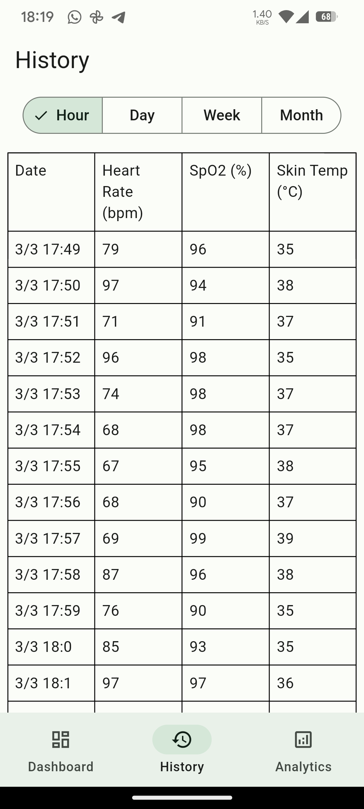

# Vital Monitoring Patch

This project is part of the Design Practicum course. It involves the development of a device named **Vital Monitoring Patch** that monitors the vital signs of neonates. The project is divided into two sub-repositories: one for the device code (Arduino) and another for the Mobile App.





## Device Code

The device code is designed to continuously monitor vital signs of neonates. It uses an ESP32S3 board to connect to a MQTT broker and send sensor data such as skin temperature, heart rate, and SpO2. The project uses various libraries such as ArduinoJson, Preferences, PubSubClient, NimBLEDevice, Wire, WiFiClientSecure, Protocentral_MAX30205, and MAX30105.

### Getting Started

To get started with the device code, you need to have the Arduino IDE installed on your machine. You can download it from the official [Arduino website](https://www.arduino.cc/en/software).

#### Installing

1. Clone the repository to your local machine.
2. Open the `code.ino` file in the Arduino IDE.
3. Install the required libraries through the Library Manager in the Arduino IDE.

### Usage

The main entry point of the application is the `code.ino` file. This file includes the necessary libraries and defines the necessary variables, functions, and classes.

The `loop` function in `code.ino` is the main loop of the program, which is executed continuously. It checks the connection status of the device and MQTT client, and sends sensor data to the MQTT broker.

The `algorithm_by_RF.cpp` and `algorithm_by_RF.h` files contain the implementation of the algorithm used to process the sensor data.

The `.vscode` directory contains configuration files for the Visual Studio Code Arduino extension.

## Mobile App

The mobile app is a Flutter application designed to continuously monitor and display vital signs data from the 'Vital Patch' device. This application specifically monitors the following vital signs of neonates:

- Skin Temperature
- Heart Rate
- SpO2 (Blood Oxygen Saturation)

### Project Structure

The project is organized into several directories, each serving a specific purpose:

- `lib/`: Contains the Dart source code for the application.
- `android/`, `ios/`: Platform-specific code for Android and iOS.
- `assets/`: Contains static files like images, fonts, etc.
- `test/`: Contains unit tests for the application.

### Key Components

- `lib/heart_rate/`: Contains the code related to the Heart Rate monitoring feature.
- `lib/skin_temperature/`: Contains the code related to the Skin Temperature monitoring feature.
- `lib/spo2/`: Contains the code related to the SpO2 monitoring feature.
- `lib/database/`: Contains the code related to the database operations, such as storing and retrieving the vital signs data.
- `lib/monitoring_page.dart`: The main page of the application that displays the monitored data.

### Getting Started

To get started with this project, you need to have Flutter and Dart installed on your machine. Once you have these prerequisites, you can clone this repository and run the application.

```sh
git clone https://github.com/amansikarwar/dp-project.git
cd dp-project/app
flutter run
```

### Code Generation

This project uses code generation for certain features. To generate the necessary code, you need to run the build runner. This can be done using the following command:

```sh
flutter pub run build_runner build
```

### Contributors

- [Aman Sikarwar](https://github.com/AmanSikarwar)
- Sia Mittal
- Rahul Shree
- Vishnu
- Jatin Prasad
- Abhijeet Kumar

### License

This project is licensed under the MIT License - see the [LICENSE](LICENSE) file for details.
